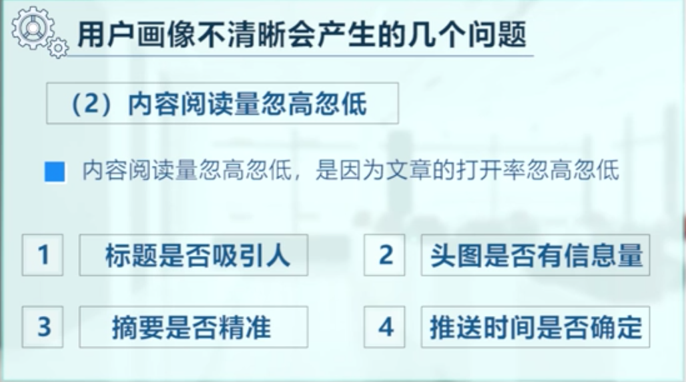
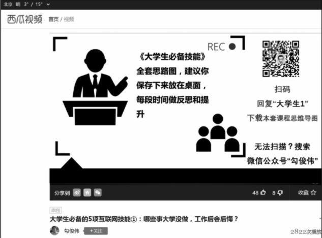
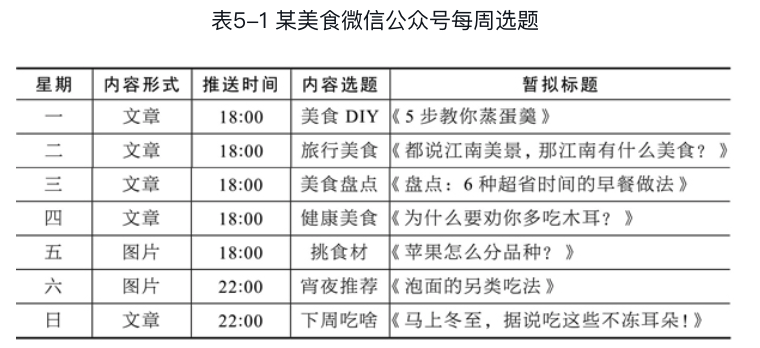

# 新媒体运营-重要原则

[TOC]

## 1.定义

新媒体运营指的是内容运营、活动运营、产品运营和用户运营四大模块的总称

### 1.1 用户运营

用户运营工作主要围绕四方面展开，包括**拉新、促活、留存及转化**

#### 用户画像

在用户运营工作中，用户画像是工作的起点。只有进行过清晰的用户画像，后续的用户分类、拉新、促活与留存等工作才有意义。

阅读量忽高忽低还有一点就是：**选题不够精准**。

> 要战略性的放弃一部分看起来有意思，但和本公众号定位不同的选题，选题一定要精准。

做出清晰的用户画像，需要做好两件事。

- 第一，提炼用户标签，用故事描述用户画像。
- 第二，绕开画像误区，防止从源头上出错。

> TODO:确定公众号的用户画像

如何做？

##### 提炼用户标签

提炼用户标签的过程，实际上是针对以下三个问题的循环研究过程。

- WHO：用户是谁？即分析**固定属性**；
- WHERE：用户在哪里？即分析**用户路径**；
- WHAT：用户在做什么？即分析**用户场景**。

**固定属性**即用户的基本特征，这些特征在短时间内不会发生变化，包括用户年龄、性别、职业、地区、学历等。

**用户路径**即用户的互联网浏览喜好，包括打开频率较高的聊天软件、常用的搜索网站、购物喜好平台等。

**用户场景**即用户在某特定场合或特定时间的动作。如在早上起床、上下班路上、晚上睡前等场景内，用户如何学习、如何娱乐等。

**一个例子**：结合用户标签，运营者可以为BetterMe 大本营进行用户画像描述：“她们目前居住在直辖市或省会城市，以20～25岁的女白领和女大学生为主。白天她们爱用微信聊天；晚上她们喜欢在微信群参加职场技能类训练营；睡觉前她们还会再用手机翻一翻微信公众号，学习成长类干货。”

#### 拉新

获取精准用户分为三个步骤，即**识别用户渠道**、**设计引入形式**、**给出引入理由**。

##### 识别用户渠道

用户画像常用到标签公式“用户标签=固定属性+用户路径+用户场景”，分析该公式中的“用户路径”，运营者可以识别出用户的活跃渠道，即找到用户“出没”的网站或软件，做好渠道布局。

> TODO:思考如何去其他平台(知乎，微博，贴吧)提升用户粉丝量

#### 拉熟

所谓拉熟就是：将路人变为忠粉。路人指的是浅层次接触的用户，他们可能只是关注了企业微信公众号，有效运营价值来自深度接触的用户，也称为忠粉。深度接触的用户，不仅关注企业账号或浏览企业文章，更多会加入企业社群、参与企业活动。

将路人变为忠粉。常用的策略包括九种，即内容、活动、资源、社群、功能、积分、奖励、投入、提醒

##### （1）内容

内容是最稳妥的促活方式。好的内容会让用户从接触账号时的“看一看内容”到“很期待，等着看内容”，完成活跃度的初始积累。通过内容增加用户活跃度不是偶尔刻意为之，而是需要新媒体运营者持续地发出高质量的文章、视频、图片等。

##### （2）活动

（目前不适合）运营者可以定期策划与组织企业新媒体活动，通过富有创意的活动吸引用户参与，提升用户活跃度。

##### （3）资源

运营者可以在部分新媒体平台放置学习资料、成长工具、工作素材等资源并引导用户下载，用资源促活。例如，运营者在今日头条旗下的“西瓜视频”上传“大学生必备的5项互联网技能”视频，并引导观众关注公众号，下载与视频相关的思维导图，如图所示。

##### （4）社群

（其实加微信号变成私域流量更好）现阶段新的公众号、富有创意的新媒体产品层出不穷，即使新媒体运营者每天推送有用、有趣的文章，用户对企业的热情度仍然会随着关注时间增加而逐渐减弱。新媒体运营者可以尝试组建用户社群，将企业与用户的关系从冰冷的“账号对人”变为带有温度的“人对人”。

### 1.2 内容运营

内容用于连接产品与用户，**运营者需要重点关注内容的定位、设计与传播，找到差异化的内容定位、创作走心的内容形式、辅之以较好的内容传播，从而触达更多用户**。

> 每次选题以及文章的编辑过程中需要考虑到以上内容：
>
> 1.内容定位：要和粉丝画像所匹配。定位决定了以后的发展方向和后期的盈利模式
>
> 2.传播：设身处地的去思考，传播率到底怎么样？

新媒体内容并不是简单的写一篇文章、录一段视频、做一张图片，而是要让更多的用户打开、完整浏览并转发到朋友圈或转发给好友。因此，新媒体内容运营的关键点是**设计传播模式**，力争获得更多的传播。

#### 1.定位

定位对用户而言，就是给他们一个关注你的理由；对你自己而言，就是你知道自己是谁，自己能做什么。

如何定位，核心是回答三个问题：

> （1）我是谁？
>
> （2）我能提供什么？
>
> （3）我和别人有什么不一样？

##### 号设化运营

简介要独特：

> （1）我很特别：介绍你和别的博主不一样的地方在哪里，你能给用户提供的最大价值是什么。
>
> （2）我很厉害：介绍你在你这个领域做过最牛的事情。（比如博主李佳琦在简介里说：涂口红世界纪录保持者，战胜马云的口红一哥。）

##### 内容定位

定位决定了以后的发展方向和后期的盈利模式。

你输出的内容最好与你的产品或服务有关联的，内容要给用户带来价值，“内容为王”是很有道理的，好的内容，粉丝关注度高，很容易吸引粉丝产生共鸣。**所以第一步就是先要明确内容输出的领域**。

比如：搞笑、娱乐、教育、健康、美食等。其中内容可以包括分享经验、教授技能、传递知识、情感关系、瘦身健康等。确定输出内容后最好就不要改变了，内容前期建议单爆一两个点，**先专注一两个点，做深做透，做到极致**，做教育就是做教育，做美食就是做美食，这样才专业，后面会越来越轻松，等到一定阶段后可以根据实际情况做调整

##### 角色定位

假如你想做一个亲子教育类的自媒体，你可能会从在一位母亲（女性）的角度去写，但类似定位的自媒体实在太多，已是一片红海。也许你从父亲（男性）的角度去写，就是一片蓝海。当然你以虚构的一个卡通、可爱、萌萌哒的角色去写的，比如：小美、傻妞、萌兔等

##### 领域选择

如果没有喜欢的，也没有擅长的，那么就从以下领域里筛选，总有一个适合你：

（1）关于赚钱的，以下四点切入，百试百灵！

a.理财的，b.创业的，c.房产的，d.职场的。

（2）关于育儿的，只要是孩子，都是父母的软肋！

a.母婴育儿，b. 教育的

（3）关于社会生活的，满足精神生活的。

a.情感的，b.时尚的，c.明星八卦的，d.运动健身的，e.美食的

#### 2.3个维度做好定位

##### （1）昵称

一个好的定位从账号的昵称就能体现出来，好的昵称就是要让人通过昵称，一眼看出你是做哪个类别的博主。

##### （2）简介

除了昵称这个“第一张脸”，简介是让用户更快更详细识别你的另一途径，因此，简介一定要能体现你做的是哪方面的内容。

##### （3）内容垂直

何为内容垂直？其实就是“专一”。决定做哪个类型的内容，就统一做这个类型的内容。

#### 3.核心环节

企业的内容运营一般分为七个环节，包括选题规划、内容策划、形式创意、素材搜集和整理、内容编辑、内容优化以及内容传播。

> 所谓核心环节，并不是去写一篇文章的核心环节，而是在内容运营的时候需要使用的一些规则以及需要做的一些事和需要养成的习惯。

##### （1）选题规划

新媒体内容运营的第一个环节是进行选题规划。新媒体领域受人关注的“10万+文章”“百万级曝光”等内容，看起来是突然爆发，其实多数是建立在扎实的日常运营基础之上。

一个表格示例：

##### （2）内容策划

> TODO：还需要根据自己的定位去设定好模板

“选题规划”做的是阶段性的内容设计，而“内容策划”做的是更具体的内容设计。在写一篇微信文章或创作一条产品广告前，内容运营团队需要进行头脑风暴，探讨内容细节，并完成内容策划。做内容策划，实际上就是解决以下重要问题。

· 制作本次内容的目的是什么？推广新品、宣传品牌还是其他？

· 内容投放渠道在哪里？微信公众号、微博、知乎还是其他？

· 该渠道的用户是谁？大学生、职场人还是其他？

· 内容制作周期是多久？内容传播周期预计多久？

· 内容主题如何设计？· 内容风格如何设计？

##### （3）形式创意

> TODO:整理各种写作模板

内容策划完成后，运营者需要思考对应的形式。用户总是对新鲜的、有创意的形式更感兴趣，如果某个账号的内容形式一成不变，用户的活跃度会逐渐降低。因此每一次发文章或者做海报之前，运营者需要思考这些内容：

· 可以写成一个故事吗？

· 可以写成一篇趣味新闻吗？

· 可以做成一张长图吗？

· 可以做成一个小问答吗？

##### （4）素材整理

内容形式敲定后，运营者需要进行素材搜集与整理。素材主要包括内部素材和行业素材两种类别。内部素材包括企业产品图、产品理念、活动流程、过往照片、过往数据等；行业素材包括行业数据、行业新闻、网民舆论、近期热点等。尽可能多地搜集并分门别类地整理这两大类素材，这一环节就基本完成了。

**此外，运营者需要养成“随手记录素材”的习惯，完善自己的素材库**。（可以是读的一本书）

##### （5）内容编辑

内容编辑实际上就是常规意义上的写文章、做海报等，属于内容运营的执行工作。

##### （6）内容优化

> 小流量测试

内容编辑工作完成后不能马上发布，而是需要进行测试、反馈及优化。如果转化率低或反馈不好，需要进行内容优化与调整。常见的测试与反馈包括如下方式。

· 文章预览直接转到粉丝群。

· 报名网址分享在朋友圈。

· 微博发布设置为“好友圈”。

· 内容海报仅部分人可见。

##### （7）内容传播

> 建立起自己的私域流量，转发到朋友圈

内容运营并非发完微信文章或发了微博就万事大吉，需要继续推广与传播，以期获得更好的内容效果。

特别是对于粉丝较少的账号，仅为数不多的人可以看到其推送的内容，传播效果有限。

因此，运营者需要设计传播模式及便于传播的内容，引导粉丝将内容转发到朋友圈、微信群或更多渠道。

### 1.3 产品运营

广义的产品运营可以把新媒体运营过程中涉及的账号、平台、活动等项目都看作产品，进行策划、运营与调试。

一个今日头条账号，其实也可以看作一件产品。在开通后，需要进行产品调研（搜索相关今日头条账号，了解其日常内容）、前期设计（头像设计、简介设计、选题设计）、上线调试（撰写文章并测试阅读数据）、正式发布（度过新手期后正式撰写）等产品运营工作。

> 用产品思维去看待公众号和知乎等产品：
>
> 比如微信关注后的导语，下方点击框的设计，一系列留存，新增数据的考量设计等。

### 1.4 活动运营

略

## 2.着重培养的能力

文字表达能力、项目管理能力、人际沟通能力、用户洞察能力、热点跟进能力、渠道整合能力及数据分析能力。

#### 1.文字表达能力

> 1.需要注重写作的科学性，表达的思路用词等，如《金字塔原理》，不能瞎写。

#### 2.项目管理能力

如发布一篇推广文章，新媒体运营者也需要进行整体的项目管理：

> 第一步，制作进度表，规划出文章发布的每个环节所需要的执行者、截止时间等细节。
>
> 第二步，整理文章需求并与编辑充分沟通。
>
> 第三步，编辑或撰写文章时，运营者需要随时关注并提供相关素材。
>
> 第四步，文章完成后，运营者需要与推广专员沟通，布局推广渠道。
>
> 第五步，监控推广效果，随时优化并做好复盘。

#### 4.用户洞察能力

爆发式运营表面上看是由于巧妙的创意或独特的思路，但深层次的原因是对用户的洞察——爆文之所以“10万+”，是由于点破了读者的孤独、焦虑、迷茫等内心情感，从而获得读者的认同；而H5之所以刷屏，也是因为满足了参与者的炫耀、跟风、猎奇等心理，而被疯狂转发。

> 反向思考：
>
> 请找到一篇你最近转发过的文章，尝试分析：这篇文章的哪部分文字打动了你？你为什么要转发？

#### 7.数据分析能力

新媒体运营者通常需要充当数据分析师的角色，懂得基本的数据分析，会使用Excel 或更专业的数据分析工具，进行数据预设、过程监控、数据总结等处理。

