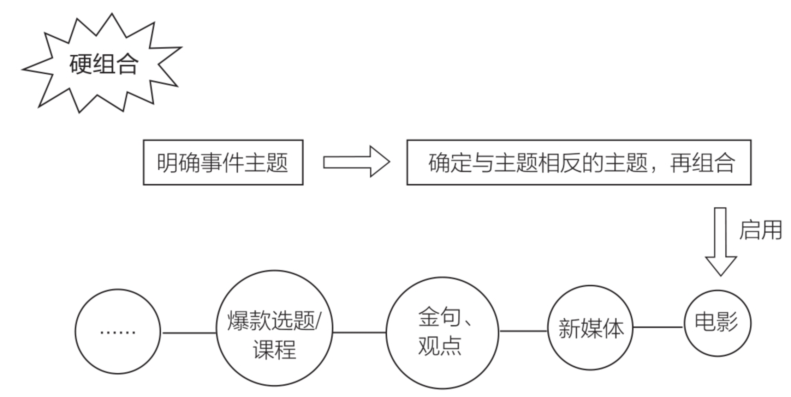
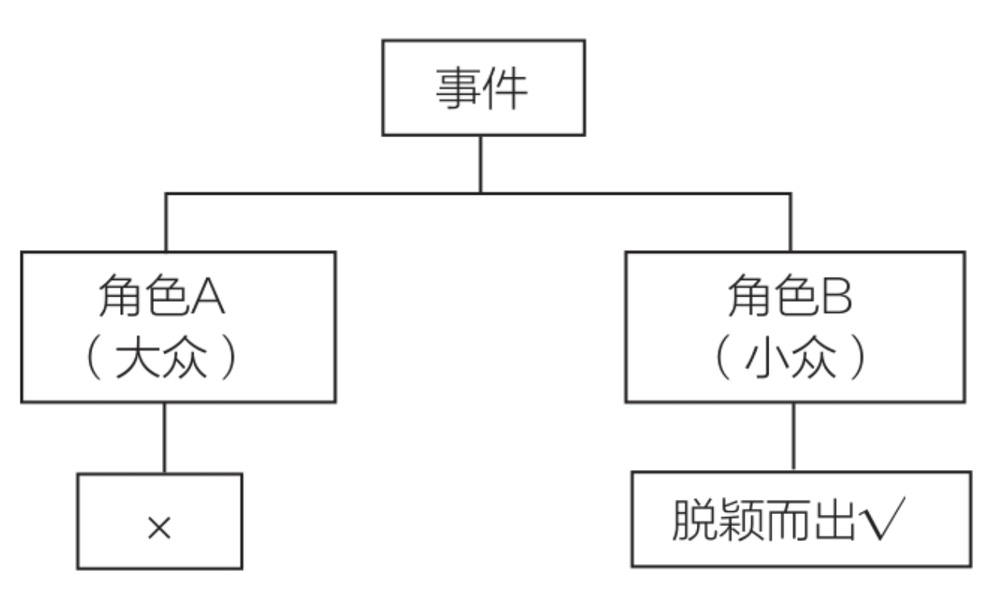

# 参考手册

[TOC]

## 做内容的底层逻辑

> 生产文章的流水线，**按步骤去套**。

### 1.文章要包含独特的观点

什么是内容：内容主要包含两类，即知识点和观点。

> 知识点：比如明朝的第一个皇帝是谁，太平天国是什么时候出现的，英语的26个字母分别是什么等。
>
> 观点：比如我们如何去看待一件事，一篇文章传递的价值，一条视频表达的态度等。

二者的区别是前者答案唯一且分对错，后者不唯一，但只有你的切入点足够深刻、特别，才能激起用户的关注、认同和转发。

**在艺术的表现上，技巧是最容易学的，色彩、构图等都可以进行练习，真正难的反而是观点。**

> 重点：文章要有观点，并且观点要独特。

### 2.文章结构

这涉及到写作范畴。

> //TODO 还需要学习写作相关

### 3.提升文章划线率

什么叫画线率，其实就是“啊哈”瞬间，就是那些让你“灵光乍现”“顿悟”“茅塞顿开”“突然开窍”的某个瞬间。

读者看完一本书，能记住的或者说能稍微有点印象的就是画线的部分，读者对于一本书的感觉是好还是不好，最直接的体现就是他画线的内容有多少。

#### 3.1 什么内容容易被划线

打开微信读书，看写作类书籍中什么类型的内容会被画线。需要名句，点睛句。

> ①**方法总结类**。比如：“我总结出一个打造100万+阅读量的文章的九字秘诀，即换角色、硬组合、小见大。”
>
> **②俗语**。比如：“人生没有白走的路，每一步都算数。”
>
> **③共鸣类内容**。比如：“北京中产阶层平均每月焦虑3次，每次都会间接打造一批10万+阅读量的文章。”
>
> **④反常识类内容**。比如：“作为大数据时代下依托互联网的写作者，一定要找到自我表达和用户需求之间的交集。”

#### 3.2 重点打造开头和结尾。

写文章讲虎头猪肚凤尾，其实写书也是一样，开头和结尾尤其重要，本书开头的部分（前言）是我精细打磨的文案，结尾部分是“爆款文章的社会性”，以此来提高书的评分。

### 4.学会模仿

#### 4.1模仿的重要性

> 研究爆款文章，学习爆款文章，模仿爆款文章。

围棋高手80%的时间不是在下棋，而是在研究棋谱。这时我才发现一件事，原来要写出爆款，就是要模仿爆款，而不是所谓的1万小时理论，也不是所谓的文笔。顿悟后我踏踏实实地去研究了1000篇爆款文章，去耐心拆解。

#### 4.2 知识可以迁移

换句话来说：就是不同平台的方案

70%和爆款相似×足够多的试验品=100%成功.

抱着试试看的心态，我按照写微信公众号文章的思路让团队采取了以下举措：

> （1）搜集爆款内容：通过搜索相关词找到500个爆款。
>
> （2）分组找共性：4人一组，有的组找选题上的共性，有的组找标题上的共性，有的组找头图上的共性，有的组找开头上的共性。
>
> （3）分享迭代：3天后团队第一次向我汇报，基本上没什么成果；然后改成每天都汇报，每天都总结；一周以后，各个组选一个代表进行全员分享。
>
> （4）以量拼概率：要求每个人每天要写5篇文章，前期不追求质量，而是拼量，即使一开始写得不好也没关系。第一周没效果，第二周就开始有爆款了。有了爆款以后，大家都会按照总结的规则来优化。
>
> （5）不做一蹴而就的爆款：不追求一步成爆款，发布以后和该类选题的爆款做对比，看缺少什么，哪里可以优化，之后慢慢改成爆款。

## 做内容的方法

### 1.硬组合：做创意的一大方法

#### 1.1底层逻辑：

> 先提出一个大家不知道的概念，然后用大家能理解的方式解释一遍，让受众有恍然大悟的感觉。

把两个不相关的领域甚至同一领域相反的词硬生生组合在一块，然后你还能解释清楚。

#### 1.2 举例

很多爆款选题或者爆款课程，都用到了硬组合。

##### 1.概念组合

之前有篇特别火的文章，文章名叫《湖畔大学梁宁：比能力重要1000倍的，是你的底层操作系统》

> 你和雷军最大的区别在哪儿？是能力吗？
>
> 不，是底层操作系统不一样。
>
> “如果把人想象成一部手机，人的情绪是底层的操作系统，他的能力只是上面一个个的App。”湖畔大学的梁宁说。
>
> 梁宁被誉为“神一样的产品经理”。雷军说她是“中关村的才女，思想深刻，洞察力强”。美团的王兴、欢聚时代的李学凌、美图秀秀的蔡文胜、豆瓣的杨勃等诸多圈中大佬都对梁宁赞誉有加。
>
> 如果把人比作手机，你的某些App是比雷军还要厉害的。

接下来作者对“操作系统”的概念进行了解释，大家才恍然大悟，原来是这样。

但其实去掉这个“操作系统”的包装，讲的还是以前的那些旧内容——个人成长、努力多元化之类的东西。

##### 2.反差组合

其中有一篇文章题为《中秋节那些永远回不去家的人》。中秋节前，我们前往北京八宝山等墓地进行采访。大家可能认为，中秋节去墓地采访是一件听起来有些恐怖的事情，但其实在这个被赋予“团圆”含义的节日里，会有很多人去墓地祭拜自己的父母、朋友、爱人。

将中秋节这个象征团圆的节日热点与永远回不去家的人、无法团圆的这类群体组合在一起，也就是我们所说的硬组合，进而可以制造反差。

在运用硬组合的技巧时，可以分为两步走：

（1）明确事件的主题。首先要明确一个热点事件中最突出、最能体现本质的主题词，比如中秋佳节的“团圆”，锦鲤杨超越的“好运”等。

（2）确定一个与之相反的主题，将二者进行结合。这

一技巧的亮点就在于与主题词完全相悖的另一个侧面，比如在中秋佳节谈“祭拜”，在杨超越的锦鲤事件中谈“倒霉”等。

公众号“萍语文”在父亲节到来之际发布的文章**《没有父亲的父亲节》**，也是使用了硬组合。

### 2.换角色：做创意的另一大方法

《让创意更有黏性》中写道，吸引他人注意最基本的方法就是：**打破常规**。

**用户适应规律性事物的速度很快，持续不变的感官刺激往往让用户视而不见且听而不闻。**

创意最简单最本质的来源就是换角色。新媒体写作也是一样。

#### 2.1例子

> 2017年10月8日，鹿晗和关晓彤公布恋情，网友炸开了锅。消息发布短短几分钟后，新浪微博的服务器居然瘫痪了。
>
> 当天新浪微博的Web架构师丁振凯结婚，不得不先把服务器的漏洞修复了，再举行结婚仪式。他成功地凭借这个热点立下了敬业人设，被网友称作“新郎程序猿”，成为微博粉丝超过三万的IT届红人。
>
> 当天最火的是鹿晗微博账号发布的一句话：“大家好，给大家介绍一下，这是我的女朋友@关晓彤。”
>
> 这条微博的转发量是127万，评论291万，点赞592万。当时很多新媒体从业者都在跟这个热点，但是大家就跟商量好的一样，基本上都是从鹿晗的角度出发。
>
> 打开微信公众号，看到的基本就是以下三个方向的内容：《敢说“大家好，这是我女朋友”的男人加100000+分》《鹿晗和关晓彤：这才是一个男生对待感情该有的态度》《鹿晗和关晓彤：爱一个人就得让全世界都知道啊》。

如果你和大家选择了同样的角度，就相当于你和1万个人站在同一个赛道上，争夺百米赛跑的冠军。如果你选择一个没有人竞争的赛道，即使不花费太多力气，阅读量也不会低，因为你和别人不一样，独特就是你最好的武器。

在鹿晗和关晓彤公布恋情的事件中共有四个角色：**鹿晗、关晓彤、鹿晗粉丝、路人**。因为鹿晗的角度已经被写烂了，很难出彩，所幸就放弃这个角度，直接从以下的几个角度出发。

> 鹿晗粉丝的角度：比如《鹿晗：我花钱买你单身》。
>
> 关晓彤的角度：比如《关晓彤：我为什么配得上鹿晗？》《关晓彤：因为足够努力，所以嫁给爱情》。
>
> 路人的角度：《幸好和鹿晗在一起的不是你》。

#### 2.3总结

社交媒体往往是一个很好的发现共鸣点的地方，高赞的内容往往就是大家的共鸣点。

屁股决定脑袋，思路决定出路，如果你站在员工的角度思考问题，你会说我渴望休息，讨厌加班；但如果你成为一名老板，就可能会改变想法，希望员工天天加班。

如果你是学生，你可能会讨厌学习；但如果你是一名教师，你会想方设法让学生认真学习。这些，都是角色转变引起的巨大思维变化。

## 文字媒体模板

### 1.开头模板

打开一篇文章，如果开头前三句话无法吸引读者继续阅读，大概率读者就不继续往下看了，那你后面写得再好也是无用功。因此，好文章的开头是必须花心思去经营的。

#### 开头模板1：问句式

问句式就是通过向读者提出问题的方式，激发读者的思考和好奇心，吸引读者往下看文章给出的回答，是一种非常常见的开头方式。问句式包括3种形式，分别是**疑问、反问和设问**，只要是用了其中一种形式的开头，都可以算是问句式

##### 举例：

比如《2020年的地狱模式，它的记录我打满分》就是运用了问句式中的设问做开头：

> 2020年的地狱开局，猝不及防的生活停摆。
>
> 还能好好活下去吗？
>
> 或许，它能提醒我们，糟糕没有底线，但生命必须怀揣希望。

《今年最期待的硬盘“禁片”来了》这篇文章也是采取了设问式开头，是这么写的：

> 什么是最恐怖的恐怖片？
>
> 有人说是不敢直视血流肉烂。
>
> 有人说是不期而遇的鬼影重重。

“毒Sir电影”的文章《9.5，凉掉所有热搜的年度神剧》推荐的是热播的台剧《我们与恶的距离》，文章开头其先引用了**热点**——北大学生吴谢宇弑母案，然后以反问的形式开头：

> 在恶发生，乃至审判之后。
>
> 我们到底还要不要去向恶叩问一个“为什么”？
>
> 如果要，又该如何叩问？
>
> 想到这些并非偶然。
>
> 而是一部剧正好和我们的现实呼应——

#### 开头模板2：对话式

对话式的开头就是将与文章情节相关的人物的对话放在文章开头。

运用这个方法时，需要注意选取能引起读者兴趣的对话，而不能是随意的一个对话，或者对后面情节没有重大影响的对话，这样的对话是无法达到引着读者往下看的目的的。

**因此，对话式开头要做到对话简短、精炼、抓人，勾着读者往下读。**

##### 举例：

1.

比如《我能想到最性感的画面，就是你跪键盘的样子》是这样写的：

> “四川好可怕”。
>
> 前几天，刷朋友圈，看到一个工作中认识的人，发了这样一条朋友圈。

开头的一句，“四川好可怕”是不是会引发你一连串的疑惑：

这句话是谁说的？

为什么说四川好可怕？

如果你是个四川人，是不是要破口大骂：凭什么说四川好可怕？

**这就是对话式开头的魅力，让你情不自禁地跟着作者的思路往下走。通过把文中亮眼的、有爆点的信息以对话的形式提前写出来，来制造悬念**，抓住读者眼球，引发读者的好奇，是一种很好用的开头方式，屡试不爽。

2.

在鲁迅的许多文章中都能找到这样的开头。【大佬的手法值得借鉴】

外国文学中如狄德罗的哲理小说《宿命论者雅克》、弗吉尼亚·伍尔夫的《达洛维夫人》《到灯塔去》也采用了对话式的开头，下面的内容就来自于弗吉尼亚·伍尔夫的《到灯塔去》：

> “当然可以，如果明天天气好，”拉姆齐夫人说，“但你得一大早就起床。”她紧接着说。
>
> “可是，”他的父亲在客厅窗前停住脚说，“明天不会晴。”
>
> “可没准儿会晴呢——我希望是晴天。”拉姆齐夫人不耐烦地说，稍微扭了扭正在织的红棕色长筒袜。
>
> “正西风。”无神论者坦斯利说。

#### 开头模板3：自我剖析式

自我剖析式就是指作者从第一人称的视角出发，向读者介绍自己“是什么样的”“做过什么”“想要做什么”“在做什么”等。

##### 举例：

1.

“子鱼ziyu”的《被爱过》就是这么开头的：

> 我是一个被人狠狠爱过的孩子，从小到大，全方位，无死角，直到如今。

文章开头就以第一人称“我”坦白“我”被爱着，而且是被“狠狠爱过”，就像与读者面对面交流，一下子拉近了与读者的距离。

##### 方法：

要写好自我剖析式的开头，需要掌握两点技巧：

> 第一点，善于自黑、自嘲。
>
> 第二点，你做的事情很特别。

《女人赚钱的意义》，它的开头是这样写的：

> 在我前三十年的人生中，一直保持着诸多陋习。

作者上来就说自己有“诸多陋习”，在猎奇心的驱使下读者会情不自禁读下去，去找答案，“她的陋习是什么”“为什么她有这么多陋习”……

通过这种自黑、自嘲的方式，让大家觉得，嘿，这个人有意思。

“视觉志”转载过一篇文章，《我25岁就把自己杀了，只是到75岁才入土》，它的开头就用了自述式的描写，是这么写的：

> 2016年，我30岁。未婚，无房，无存款。这些都不重要了。我只是不想这么快就死去。

一连串的名词：“未婚”“无房”“无存款”与30岁这个年龄联系起来，肯定会让一些读者感到焦虑，后面又接一句“我只是不想这么快就死去”，读者就更焦虑了，甚至产生疑问：为什么会死？通过你做的特别的事，引起读者的注意力和好奇心，让他按照你设定的路线一步一步阅读下去。

#### 开头模板4：名句式

在学生时代写作文时，老师特别钟爱学生引用名言，因为名人说的话有权威，有公信力，这样文章的认可度就高。用“名句”作为文章开头目的也是如此，通过引用大家耳熟能详的名言名句，来提高读者对文章的认可度，要知道，读者不认可是不会继续往下读的。

##### 方法：

运用“名句式”模板开头有两种方法：

> 第一种是直接引用。
>
> 第二种是解构名句，换言之就是改造名句。

**直接引用：**

“假装在纽约”的《我的愿望是，活过30岁》开头就引用了两句名句：

有两句话，常常会引起我们巨大的共鸣。

一句是《约翰·克利斯朵夫》里写的：

> “大部分人在二三十岁就死去了，因为过了这个年龄，他们只是自己的影子，此后的余生只是在模仿自己中日复一日地度过。"

另一句是日本作家本间久雄的名言：

> “很多人都是30岁就死了，80岁才埋葬。”

这篇文章开头引用了《约翰·克利斯朵夫》和本间久雄说的名言，表达了“大多数人在30岁就停滞不前了”这个观点。

作者认为很多人将外界给自己贴的标签变成自我设限，不敢打破，一直待在舒适区，重复自己前30年的人生。

**这个观点本来有点让人难以接受，毕竟没有人愿意承认自己在苟且，但用了两个名言做开头，那种天然的权威让人一时无法反驳，从而含蓄地引出了一个犀利的观点。**耳熟能详的名言不会造成读者的陌生感，还提升了文章的文采，是一个比较容易掌握的开头模板。

**解构名句：**

比如，托尔斯泰的《安娜·卡列尼娜》的第一句话就是“幸福的家庭都彼此相似，不幸的家庭却各有各的不幸”，这句话广为流传。

我们可以仿照这个句子结构，写一句“美的人都彼此相似，丑的人却丑得千奇百怪”，句式结构非常眼熟，说的道理也是“不好的事情都各有各的悲哀”，只不过原句说的是家庭，这里说的是长相。结构让人熟悉，而观点又让人耳目一新，读者读来会觉得作者构思精巧。

#### 开头模板5：时事热点式

时事热点式开头是指引用热点事件、热点人物、热点话题、热门影视作品等来开篇。因为这些热点本身自带热度，受众很广，读者在看到自己感兴趣的热点作为开头后，会不自觉地“爱屋及乌”，想把文章读完。

“乌鸦电影”的

> 《气到发抖！差点被打死的网红背后，藏了多少血淋淋的现实……》，

就用仿妆网红宇芽被家暴的热点作为开头，来表达其对女性地位问题的关注：

> 昨天，是国际反家暴日。
>
> 然而，昨天的微博热搜第一，却直接挂上了一名被家暴女性的自白视频。

再比如前面提到的“毒Sir电影”，其《9.5，凉掉所有热搜的年度神剧》这篇文章要推荐的是《我们与恶的距离》，

这部剧里的第一个案件就是关于家庭给子女的压力太大，导致子女变成了杀人犯。

文章开头征引了当时引起广泛争议的吴谢宇案，一方面契合了推荐的电视剧，更重要的是吴谢宇案的代表性和讨论度极高，以它作为开头，读者自然想看看作者要推荐什么好剧，和现实如此契合了。

##### 选题：

最近很“火”或者很有争议的人，以及影响很大的事件，再或者被热议的电视剧、电影、小说等，都是时事热点式开头模板的快捷选取对象。

### 2.结构模板

写文的痛点：

> 一种是想到哪里写到哪里，写作没有规划，文章写出来后没有逻辑；
>
> 一种是让他说能说得天花乱坠，但真正去写的时候又不知从何下手。

写文章要注重文章的结构清晰。

这里给出4种用得最多的文章框架模板，分别是**“1个观点+ N个事例”“总论点+分论点”“1个观点+N个角度”和“1个观点+同一个人的多个事迹”**。

#### 结构模板1：1个观点+N个事例

##### 方法：

> 第一部分，在开头或就在标题处引入主题和观点，选取的观点应尽量吸引人，有爆点。
>
> 第二部分，通过多个故事解释、分析这个观点，比如上面提到的《世间所有的错过，都无须重逢》中就用了三个故事，详细阐述了不同选择都会产生遗憾，因此“错过无须重逢”。
>
> 第三部分，结尾，升华文章。通过重述观点，再回到现实，给读者一个行动的召唤。使用这个模板的关键在于选取的事例，选取的事例要能论证观点，还要具有一定的传播度，不能是太生僻的例子。

##### 例子：

“拾遗”就经常用这个结构模板写作。其《世间所有的错过，都无须重逢》这篇文章的观点就是标题“世间所有的错过，都无须重逢”，文章用了3个不同的例子，论证了为什么“世间所有的错过，都无须重逢”。

> 第一个例子是，两个朋友，一个后悔没去当公务员，而去做了小学老师，一个后悔做了公务员，没去北漂。最后，每个人都在遗憾自己“所错过的”，殊不知，那个遗憾没去当公务员的老师，他的“错过”正是那位当了公务员的人现在的遗憾。一个人的遗憾是另一个人所厌恶的现状，第一个事例很好地论证了观点“世间所有的错过，都无须重逢”。
>
> 第二个例子是《荼蘼》的剧情。《荼蘼》的女主角面临着去上海发展还是留在台湾陪男朋友的抉择，A面剧情是她去了上海，但女主角最后劈腿上司，B面剧情是她留在台湾陪男朋友，生活失意，熬成黄脸婆。无论哪种选择，似乎都没有称心如意，既然所有选择都会有遗憾，那么错过的也无须懊悔，再一次论证了“世间所有的错过，都无须重逢”。
>
> 第三个例子是一个童话。池塘里的青蛙看见亮晶晶的凹地，向往极了，于是历尽艰辛跳过去，到了那个亮晶晶的凹地时，青蛙发现那个心驰神往的地方不过是条臭水沟。原来向往的地方也可能没有想象中的美好，甚至只是条臭水沟，那么错过便错过了又如何，又一次证明“世间所有的错过，都无须重逢”。

这里的3个例子都是为印证“世间所有的错过，都无须重逢”这个观点服务的，多个事例强化了观点的力度，论证有力，深入人心。

#### 结构模板2：总论点+分论点

“总论点+分论点”的方法适用于你的观点足够吸引人的情况。

这里的“总论点”就是指一个总的、核心的论点，“分论点”是“总论点”延伸出的论点。这些“分论点”的存在是为了论证“总论点”的正确性的，是为“总论点”服务的，因此“分论点”不能背离“总论点”。

##### 方法：

> 总结一下“总论点+分论点”模板的用法：
>
> 首先，提出一个总论点，再围绕它提出分论点去论证总论点；
>
> 其次，用事例阐释这些分论点，解释到位；
>
> 最后，在文章的结尾，可以试着辩证分析反常规的观点，也就是你的“总论点”，使读者更容易接受，并对读者的生活产生实际参考价值。

##### 例子：

“Spenser”的《30岁没做到管理层，这辈子就这样了》就运用了“总论点+分论点”的结构模板。

这篇文章的“总论点”就是“30岁没做到管理层，并不一定这辈子就这样了”，与标题表达的意思相反。

在下文中，“Spenser”又用了3个“分论点”来论证这个“总论点”，分别是

> 30岁，或者30出头没做到管理层，本来就是件很正常的事”
>
> “职级不是权威，专业才是”
>
> “能在自己原生的条件下努力，实现超越自身环境的卓越，就是成功”。

> 第一个分论点认为，30岁做不到管理层才是常态。不可能所有人都在30岁就会成为管理者，可能是35岁，可能是40岁，也可能是50岁。
>
> 第二个分论点认为，专业才是未来社会竞争的王道，不是成为管理者就意味着成功，有技能、够专业才能在未来的竞争中立稳脚跟，因此，追求“30岁就做到管理层”本身就是伪命题。这个“分论点”从问题根源上抨击“30岁没做到管理层，这辈子就这样了”这一观点，更进一步论证了“总论点”的正确性。
>
> 第三个分论点认为，超越自身才是成功的定义。每个人的起点不同，有的人就生在罗马，我们没有必要和他们比，那样只会造成无谓的焦虑。我们要做的是和自己竞赛，每天都比昨天的自己更好一点，每天都朝着做更好的自己的目标前进，30岁的你比25岁的你优秀，40岁的你比30岁的你优秀，50岁的你比40岁的你优秀，就足够了。因为成功不是意味着“成为管理层”，而是成为更棒的自己。重新给成功下了定义，完完全全驳斥了“30岁没做到管理层，这辈子就这样了”这个观点，同时也论证了自己的观点。

这篇文章从各个角度深入分析了核心观点，逻辑性很强，层层递进，有理有据，以理服人，读者即使不能完全同意，也无力反驳。

#### 结构模板3：1个观点+同一个人的多个事迹

如果要描写的人物的生平故事很丰富，有许多生平都可以反映核心观点，那么选取“1个观点+同一个人的多个事迹”的结构模板写作就非常合适。

### 3.结尾模板

总结的4个结尾模板，分别是

> “概括式结尾”
>
> “点名式结尾”
>
> “名句式结尾”
>
> “排比句式结尾”，

这些模板不仅适用于写情感文，写干货类文章、广告语等也都是适用的。

### 4.如何讲故事

知道故事的来龙去脉并不见得能把故事讲得吸引人，有的人自以为深谙“讲故事”的门道，最后把故事讲成了事故。

“4 +3 +2”故事模板——4步搞定故事、3点完善故事、2招引爆故事。

#### 4步搞定故事

4步搞定故事模板：

> （1）一句话。即交代故事的开头和结果。
>
> （2）定冲突。就是给故事主人公“加戏”，使情节起波澜。没有情节的波澜起伏，就难以冲击读者内心，因此，“定冲突”对于“讲好故事”来说是灵魂般的存在。
>
> （3）给理由。即给出理由，解释为什么冲突会发生。
>
> （4）来组合。简言之就是将上述的几个部分重新进行排列组合。

##### 举例

我们用《肖申克的救赎》来分析一下。

> 一句话：“主人公银行家安迪被诬陷入狱，最后他不甘心并成功越狱”。这里就讲了故事的起因（被诬陷入狱）和最终结果（成功越狱）。
>
> 定冲突：“想用上诉洗清罪名出狱，但遭遇监狱长的阻挠”。这里来了个大冲突，因为本来安迪已经找到证人证明自己清白，只要能上诉，就可以恢复自由身，但反而是平时和自己交好的监狱长阻挠了自己出狱。这个冲突给这个故事情节造成大冲击，因为如果没有这个冲突，安迪顺利上诉出狱，也就没有最后基督山伯爵式的越狱传奇了。
>
> 给理由：“因为安迪帮他偷税漏税并且干得特别好”。为什么平时安迪和监狱长关系不错，关键时候反而阻挠安迪上诉呢？后来电影给了理由，原来是因为安迪作为银行家，在做账方面是个好手，监狱长想让安迪永远为自己服务，为自己做假账，因此百般阻挠安迪上诉，还将人证转移到其他地方。
>
> 来组合：将上面的几个要素组合起来，最后形成故事框架。

我的这篇《曾帮我打架的兄弟，现在和我不再联系》里几个故事的叙述，也套用了这个模板。

> 一句话：“我特别好的朋友差点和我断了联系”。一句话交代了整件事情，我的铁哥们强哥和我差点断了联系。
>
> 定冲突：“强哥结婚我没去，强哥带媳妇儿来北京玩我没陪他”。好友结婚、好友来我的城市玩，我都未出现，这两件事一般都不会发生在两个挚友之间。
>
> 给理由：“都是兄弟，他可以担待的”。给出上面冲突点的理由，因为我太忙了，因为我觉得是这么好的朋友，所以可以肆无忌惮，强哥会“担待”的。
>
> 来组合：将上面3步组合起来，就形成了这个故事的框架——强哥结婚我没去，强哥带媳妇儿来北京玩我没陪他，因为我觉得都是兄弟，他可以担待的，最后我特别好的朋友差点和我断了联系。

#### 3点完善故事

“4步搞定故事”是搞定了故事的大轮廓，只有轮廓美那只能是“背影杀手”，想要近看也美，就需要使故事情节更饱满，更吸引人，这就需要利用以下3点去完善故事：

> （1）交代故事背景。
>
> （2）补充核心信息。
>
> （3）触发情绪爆点。

##### 举例

我2017年写的《当你越过“山丘”，看到的却是物是人非》，就大致套用了这个模板。

> 第一部分就是在“交代故事背景”。这一部分讲了《山丘》这首歌第一次出现在我人生中——是因为我喜欢的女生喜欢李宗盛才去听的。这里就交代了背景信息——《山丘》这首歌，但我年少无知，并没有听懂这首歌。
>
> 
>
> 第二部分补充了核心信息——《山丘》里有一句歌词影响了我后来的人生歌词：嬉皮笑脸面对人生的难。这一部分写了父亲经历生意场上的失利后，在父亲送我上大学的路上，我听到《山丘》，红了眼眶，告别父亲时我第一次“嬉皮笑脸面对人生的难”。这里用了《山丘》的歌词，也暗合了我第三部分里写的，未来要“嬉皮笑脸面对人生的难”。
>
> 
>
> 第三部分，通过前面两步的铺垫，我用我只身北漂、无人理解的经历，来触发读者的情绪点：可是身边越来越多的人感觉我混得不错，自己过得比较节省，推了很多饭局，每次对方问为什么的时候，我就笑着说没钱，他们就说，老哥，你这破万元的工资还哭穷。刚好耳机里响起了“越过山丘，才发现无人等候”，我崩溃大哭。不是因为工作有多委屈，有多辛苦，而是身边懂我的人越来越少。

#### 2招引爆故事

搞定了故事的大轮廓，也丰满了故事情节，使“背影杀手”变成近看也美的美女，要晋级成为艳惊四座的“大美人”，就需要这两招去引爆故事：

> （1）打乱顺序。
>
> （2）场景演绎。

平铺直叙的写作方式，读者很好理解故事发生的顺序，但是没有什么亮点可言，索然无味，打乱顺序这一招解决的就是这个问题。“打乱顺序”就是运用“插叙”或者“倒叙”的叙事手法，将事件的时间、空间结构打破重组，同样的一个事情，就会被叙述得更加吸引人。——《想见你》、《盗梦空间》。

> 我在写东西的时候，一般不会出现“我很开心”“我很难过”“我很焦虑”这种直白的表达情绪的词汇，而是会通过一些人物之外的场景描写来表现这些情绪。比如要表现一个人犹犹豫豫，开不了口时，可以这么写：他的对话框里的光标往后又向前移动了好几个回合，屏幕那头的女孩，看着一直显示的“正在输入”，最后，发来的却是“嗯嗯”。再比如为了表现一个男生失恋了很难过，我会这样写：

### 5.金句模板

无论是做新媒体还是做广告，或者做其他类似的产品，我们都希望我们做出来的东西能被记住，能被传播，被记住、被传播很大程度上取决于你做出来的东西有没有让人眼前一亮的地方，而“金句”就可以很好地做到这一点。

能让人眼前一亮的金句，至少要满足两个条件：

> 一个是形式上的，句子要么对称，要么工整，要么押韵……
>
> 另一个是内容上的，句子一定要反映一定的内涵，一定要能激发读者的共鸣，否则即使句子形式很优美，内容上空洞，言之无物

7个金句模板分别是“1221句式”“1213句式”“拆字法”“搜词法”“具象法”“否定法”“押韵法”。

#### 金句模板1：1221句式

> 《三体》中的一个句子——“给岁月以文明，而不是给文明以岁月”。

这句话套用了帕斯卡的

> “给时光以生命，而不是给生命以时光”，

是要表达应该在活着的时候尽情地活着，不要虚度光阴，而不是到将死之时，偷生续命，苟延残喘。

在《三体》的语境中，我们可以理解为对于走向衰败的文明，如果给它强行续命，延长它的“岁月”，只会使之变得丑陋不堪，变成文明继续向前发展的阻力。

##### 1.重新定义

“重新定义”就是我们在写句子时，一个事物原本大众对它的认知是A，现在我赋予它截然不同的含义B。通过这样的方法，你就可以轻松写出一个1221形式的句子了。

我们可以写出这样的句子，**“哪有什么不看脸的一见钟情，一见钟情就是看脸”**。这个句子就给“一见钟情”赋予了新的含义。

再比如老革命家张闻天的一个句子，特别打动我，**“生活的理想，就是为了理想的生活”**，这里就是在重新定义“生活”。

##### 2.抓住从属关系

“从属”关系就是“谁”属于“谁”的问题。

前半句中“A属于B”的从属关系是人们习以为常的，在后半句中将其颠倒后变成“B属于A”，违反人们正常认知中的从属关系，特别吸人眼球。当然，不可以为了夺人眼球去违反认知，要有一定的道理和依据。

**举例：**

> “财富从不属于葛兰台，但葛兰台属于财富”
>
> 地球从来都不属于人类，而人类却永远属于地球

##### 3.利用反义词

利用反义就是在“1”和“2”的位置上用含义相反的词或者短语组成金句。

我们可以用“收获”和“错过”这两个含义相反的词，写一个这样的句子——

> “我以为等待可以收获爱情，没想到错过爱情恰恰因为等待。”

##### 4.变换主被动

变换主被动就是在1221结构的基础上，使前半句与后半句的主被动关系相反。

“扼住命运的咽喉”，我们可以用“变换主被动”的方法试着改写一下这个句子：

> “不扼住命运的咽喉，就要被命运扼住咽喉”。

林语堂老先生80多岁高龄时写出

> “人生在世，还不是有时笑笑人家，有时给人家笑笑”。

这里的“笑人家”和“被人家笑”也是一对主被动关系，看似云淡风轻，实则是林老先生一生的感悟。

#### 金句模板2：1213句式

1213句式是金句的第二个模板，要如何理解这个句式呢？我们不妨先看看它长什么样：

> “为你明灯三千，为你花开满城”。

##### 1.核心词相反关系

运用“核心词相反关系”的方法去写1213句式的关键在于学会“找场景”。

《故事》这本书里解释，

> “场景是在某一相对连续的时空中，通过冲突表现出来的一段动作，理想的场景即是一个故事事件”。

确定要描述和表达情感的场景后，再运用含义相反的辞藻建构**冲突**，场景越动人，冲突越能出效果，越能打动人心。

我为《后来的我们》写宣传语的时候用的就是“核心词相反关系”的1213句式：

> 后来的我们，为了谁四处迁徙，为了谁回到故里？
>
> 后来的我们，有多少衣锦还乡，有多少放弃梦想？
>
> 后来的我们，有多少跑赢了时光，有多少弄丢了对方？

考虑以上排比句中的 反义词，冲突词。

##### 2.核心词递进关系

> “有的歌，听的是音符；有的歌，听的是情怀。”

> “别人这么努力是为了生活，我这么努力是为了生存。”

## 短视频

### 短视频误区（文本相关的也适应）

#### 误区1：不要自嗨

很多朋友会跟我抱怨，真是不懂读者，这么好的文章不看，反而看一些特别垃圾的文章。

最开始我也这么认为，但当我后来长时间日更和写作的时候，我发现读者的眼睛是雪亮的，你一篇文章写得好不好，哪里不好，从读者的留言中基本都能找到答案，而且读者的评价特别到位。

**你要时刻记住，我们的感知可能90%以上都是错的。所以做内容一定要找到自我表达和用户需求之间的交集，只有这样才有可能做出属于你的爆款。**

我发现这几类人的作品都存在一个共同的问题：孤芳自赏。他们拍出了自己认为的亮点，自己喜欢的风格。但他们从来没关心过用户喜欢什么，这是典型的缺乏“用户思维”的表现。

很多人会问那怎么才能找到用户的需求点呢，其实就是多去看爆款，从其中找到自己认同的作品，然后加上自己的观点，对爆款进行创新，做出符合自我表达和用户需求交集的内容。

#### 误区2：不够专一

一般短视频账号往往都是在记录生活，而且是特别随意地记录生活。

今天出去玩，发点旅游的内容，明天去吃东西，拍点美食，看最近有个舞蹈很火赶紧去模仿，后天看别人……作品涵盖了美妆、搞笑、情感、旅行、美食、唱歌跳舞等内容，别人点进来看了以后都不知道这个账号是干什么的。

**用户会因为你拍的某一个爆款视频看到你，但会不会关注你，一般取决于你的视频内容是不是同一类别的，所以只发一类视频十分重要。**

#### 误区3：没有特点

每个人都有自己的特点，我们要做的就是去发现自己和别人身上不同的点。漂亮的皮囊千篇一律，有趣的灵魂万里挑一，只有不同于别人的地方，才能被记住。

#### 误区4：没有梗

很多时候，我们记住一个人，往往是因为他做过一件事，说过一句话，甚至通过一个动作、一个眼神就会想起他，这就是他的梗。

梗一定要经常出现在你的作品中，要反复强调和不断重复，当别人看到这个梗，第一时间就能想到你的时候，你就成功了！

> 李佳琦目前在抖音上的获赞数是2.8亿，粉丝数超过4000万，为何他会有这么多粉丝？为何他会突然走红？有段时间，我们身边总会听到有人模仿他的口头禅“买它！买它！”“Oh my god，我的妈呀，太美了吧！”

